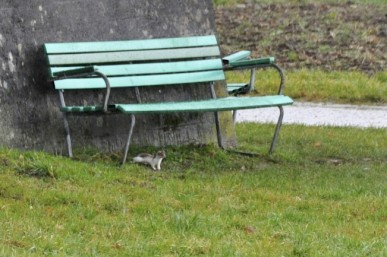
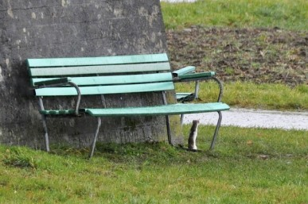

```{r, echo = FALSE}


```


Im letztjährigen Frühling (also im Jahr 2013) war es, als ich mit meinem
Hund ganz in der Nähe besagter Tennisplätze unterwegs war. Die Wiesen
ausgangs Dorf leuchteten grün mit restlichen Schneeflecken darin. Einer
dieser Schneeflecke bewegte sich plötzlich. Da es zeitweilig böig
windete nahm ich zuerst an, es handle sich um einen achtlos
weggeworfenen Plastiksack, der vom Wind hin und her geweht wird. Die
Sprünge, die dieser vermeintliche Sack machte, kamen mir dann aber doch
etwas seltsam vor. Mittels Feldstecher, den ich als Ornithologin immer
dabei habe, entpuppte sich der weisse Derwisch als Hermelin. Also ein
Wiesel im Winterkleid. Diese Entdeckung war so toll, dass ich regelrecht
Herzklopfen bekam. Da das Tierchen sich von mir und meinem ruhigen Hund
überhaupt nicht stören liess, konnte ich es sogar mit meinem Handy
filmen.

Vor wenigen Wochen (Ende Januar 2014) sorgte eine weitere Hermelin
Sichtung für ausserordentliches Herzklopfen bei mir. Im gleichen Gebiet
- noch näher bei den Tennisplätzen - nahm ich wieder einen weissen Fleck
wahr. Auch dieser hüpfte hin und her. Und wieder war das Wetter
stürmisch. Doch diesmal hatte ich keinen Feldstecher dabei, weil ich
etwas unverhofft hier unterwegs war. Ich hatte nämlich gerade die
Tennisplätze für die erste Wiesel Reportage fotografiert und wollte mich
auf den Heimweg machen. Nur, den Fotoapparat hatte ich im Rucksack. Auch
dieses Hermelin liess sich von mir nicht stören, obwohl ich zuerst mein
Velo parkieren und den Rucksack öffnen musste, und ich an erhöhter
Stelle gut sichtbar war. Es gelangen mir einige nicht ganz scharfe
Fotos. Doch gut zu erkennen ist, dass das Hermelin wegen des bisher
milden Winters nicht gänzlich weiss gefärbt ist.

Das schönste an diesen Beobachtungen ist zu wissen, dass sich die
sympathischen kleinen Räuber im Gebiet Chirchmoos nach längerer
Abwesenheit wieder heimisch fühlen. Die in den letzten Jahren
umgesetzten Lebensraum Aufwertungen wie ganzjährige Säume,
Altgrasstreifen und Steinhaufen haben sicher einiges dazu beigetragen.

Susanne Heusser

```{r,results='asis', echo = FALSE}
pander::pandoc.horizontal.rule()

pander::pandoc.link(url = glue::glue('{params$editurl}{params$rmdpath}'),text = 'Artikel bearbeiten')
```

<!--http://wieselundco.ch/faszination-kleinraubtiere/mensch-wiesel/25-braun-weisses-hermelin-in-kilchberg-->
