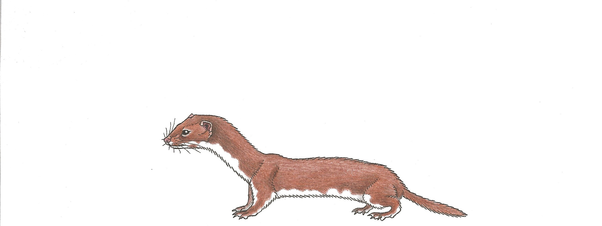
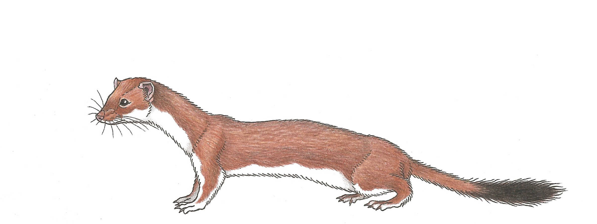
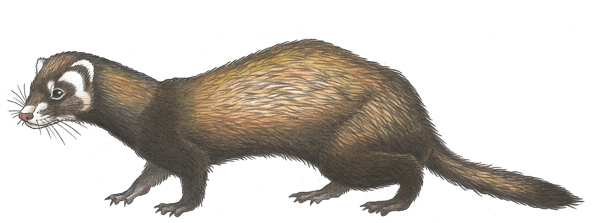

In den engen Mäusebauten können die Wiesel sich keine Fettreserven
erlauben und so sind sie im ständigen Wechsel von Ruhe- und
Aktivitätsphasen. Daher lassen sich die neugierigen Tiere über das ganze
Jahr und zu jeder Tages- und Nachtzeit beobachten.


 
<table>
 <thead>
  <tr>
   <th style="text-align:left;">  </th>
   <th style="text-align:left;"> Mauswiesel </th>
   <th style="text-align:left;"> Hermelin </th>
   <th style="text-align:left;"> Iltis </th>
  </tr>
 </thead>
<tbody>
  <tr>
   <td style="text-align:left;"> Kopf-Rumpf-Länge </td>
   <td style="text-align:left;"> 20cm </td>
   <td style="text-align:left;"> 30cm </td>
   <td style="text-align:left;"> 40cm </td>
  </tr>
  <tr>
   <td style="text-align:left;"> Schwanz Länge </td>
   <td style="text-align:left;"> 5cm </td>
   <td style="text-align:left;"> 15cm </td>
   <td style="text-align:left;"> 15cm </td>
  </tr>
  <tr>
   <td style="text-align:left;"> Fellfärbung </td>
   <td style="text-align:left;"> Ganzjährig braun-weiss Unruhige Trennlinie Ober-/Unterseite </td>
   <td style="text-align:left;"> Auffälliger Schwanz mit schwarzer Schwanzspitze Weisses Winterfell Scharfe Trennlinie Ober-/Unterseite im Sommerfell </td>
   <td style="text-align:left;"> Unverkennbare Gesichtsmaske Dunkle Grannenhaare, beige Unterwolle </td>
  </tr>
  <tr>
   <td style="text-align:left;"></td>
   <td style="text-align:left;">  </td>
   <td style="text-align:left;">  </td>
   <td style="text-align:left;">  </td>
  </tr>
</tbody>
</table>

 

 

 

```{r,results='asis', echo = FALSE}
pander::pandoc.horizontal.rule()

pander::pandoc.link(url = glue::glue('{params$editurl}{params$rmdpath}'),text = 'Artikel bearbeiten')
```


<!--http://wieselundco.ch/faszination-kleinraubtiere/unsere-leitarten/12-who-is-who-->
