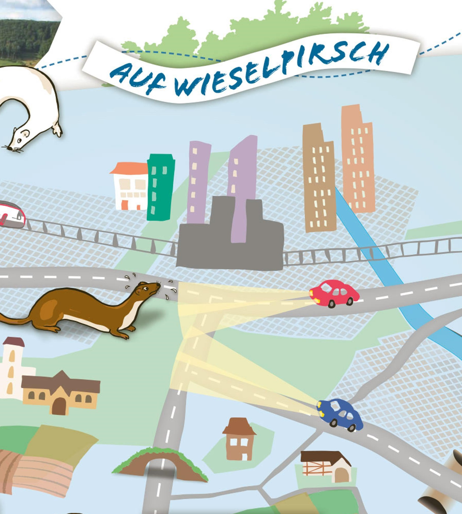

Die <a href='https://map.wanderland.ch/?lang=de&p=&route=all&photos=yes&logo=yes&season=summer&resolution=1.01&E=2692342&N=1226467&bgLayer=pk&layers=Wanderland%2CStation&trackId=6665128' target='_blank'>Zwei-Seeli-Tour</a> führt durch die Hügellandschaft zwischen Hütten, Schönenberg und Samstagern.

[Flyer BirdLifeZürich](BirdLifeZurich-Wieselpirsch.pdf)

```{r, echo = FALSE}

```


