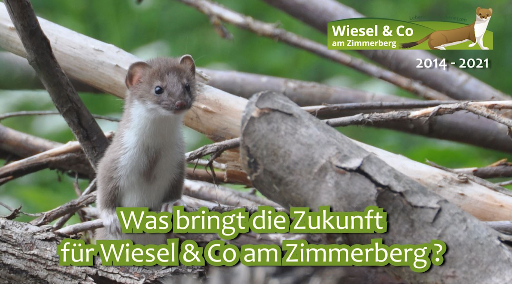
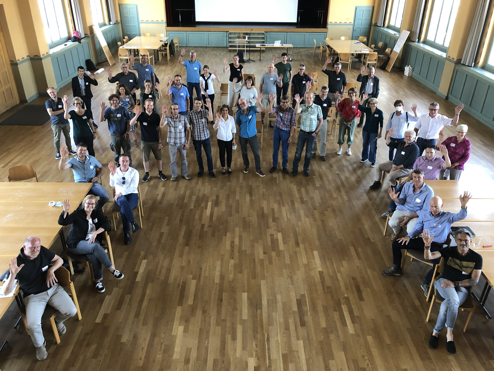

```{r setup, include=FALSE}
knitr::opts_chunk$set(echo = FALSE)
```

Um die Errungenschaften, das Netzwerk und das Knowhow in Zukunft zu nutzen, bleibt diese Website mit Ihren zahlreichen Dokumenten und Praxishilfen bis auf Weiteres bestehen. 

**[Je Trägerschaftsverein gibt es weiterhin eine Ansprechperson](/ueber-uns/27-die-traegerschaft-wir-stellen-uns-vor/)**, die künftig auf Ihre Fragen und Anliegen zu Wiesel & Co eingeht bzw. für das Anliegen nach Bedarf an die passende Person weiterverweist.

[Richten Sie ihre **Beobachtungsmeldungen** bitte in Zukunft ans CSCF](/Beobachtung-Melden.html) - dort sind auch die bisherigen gesammelten Daten gut aufgehoben und werden zugunsten unserer Wildtiere und ihrer Lebensräume genutzt.

Eines unserer beiden projekteigenen Videos, **["Was bringt die Zukunft für Wiesel & Co am Zimmerberg?»](youtube Link folgt wohl erst im September)** erörtert aus Sicht der Projektbeteiligten, welchen Herausforderungen zukünftig mit welchen Lösungsansätzen begegnet werden kann und welche Visionen schon vorhanden sind.



Inzwischen wurde das **Naturnetz Zimmerberg** initiiert und befindet sich in der zweiten Phase, dem Aufbau einer breit abgestützten Trägerschaft. 
Damit gewichtige Interessengruppen mit Bezug zu Natur & Landschaft eine geeignete Form der Zusammenarbeit, gemeinsame Ziele und erste Projektideen entwickeln können, hat die Zürcher Planungsgruppe Zimmerberg finanzielle Mittel für den Trägerschaftsaufbau gesprochen. 



Dieses Bekenntnis der Standortgemeinden ist ein wichtiges Signal für weitere Körperschaften u.a. aus Landwirtschaft, Forst, Jagd & Fischerei, Naturschutz, Stanortförderung etc. 
Die [Zürichsee-Zeitung berichtete am 2. August 2021](https://www.zsz.ch/neues-netzwerk-soll-natur-am-linken-seeufer-foerdern-822039542417) von der ersten Infoveranstaltung und den Hintergründen und Aktualitäten.

Herzliche Dank fürs bisherige Engagement und in Zuekunft vill Freud und Erfolg bim Isatz für d Natur & Landschaft am Zimmerberg!
