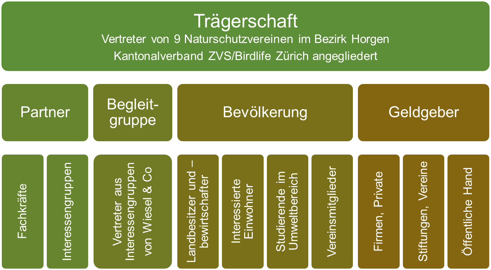

```{r, echo = FALSE}


```


Mit folgenden Interessengruppen wurde schon früh eine
Zusammenarbeit möglich und das Netzwerk sollte noch um einiges grösser werden:

Landwirtschaft und -eigentümer:

- <a href='http://www.schluchtalhof.ch/' target='_blank'>Werner und Karin Fankhauser, Schluchtalhof Wädenswil</a>
- Werner Höhn, Stocken
- Esther Scherz, Aahalden
- Susanna Kramer, Steinweid
- Emmi und Ernst Streuli, Untere Rietwies
- <a href='http://www.biohof-steinacher.ch' target='_blank'>Werner und Eva Haab, Steinacherhof</a>
- Stephan Vetsch, Stockengut Kilchberg
- Hannes Leuthold, Hirzel

  
Jagd:

- Jagdgesellschaft Bocken, George Scott
- <a href='http://www.aln.zh.ch/internet/baudirektion/aln/de/fjv.html' target='_blank'>Fischerei- und Jagdverwaltung des Kantons Zürich</a>, Jagdadjunkt Jürg Zinggeler
- Gilbert De Steffani , Leiter des Jagdbezirks Amt
- Jagdgesellschaft Schönenberg, Hanspeter Pfister
- Jagdgesellschaft Hütten, Willy Baumann
- Sepp Leu, Präsident der Jagdaufseher des Kt. Zürich
- Jagdgesellschaft Adliswil, Ulrich von Rickenbach

  
Naturschutz:

- Fachstelle Naturschutz, Corina Schiess und Sylvia Urbscheit
- Livia Haag, Obstgartenprojekt Horgen-Wädenswil
- Michael Schlitner, Vernetzungsprojekt Wädenswil-Horgen und Hütten
- Daniel Winter und Hannes Leuthold, Vernetzungsprojekt Hirzel-Schönenberg
- Cristina Boschi, <a href='http://www.wieselnetz.ch/' target='_blank'>Stiftung Wieselnetz</a>
- Mathias Villiger, <a href='http://www.birdlife-zuerich.ch' target='_blank'>ZVS/Birdlife-Zürich</a>
- Heiko Schindler, Vernetzungsprojekt Rüschlikon
- Darius Weber, Hintermannweber
- Matthias Wüst, freischaffender Umweltpädagoge und Wildtierbiologe
- Ursula Bollens, LEK und Vernetzungsprojekt Kilchberg
- Ueli Bauer, Naturschutzkomission Schönenberg

  
Gemeinden:

- Andreas Stoll, Planen und Bauen, Wädenswil
- Denkmalpflege und Naturschutzkomission Wädenswil
- Hannes Leuthold, Gemeinderat Hirzel
- LEK-Gruppe der Gemeinde Kilchberg
- Hans Bär, Ackerbaustellenleiter Hirzel
- Ernst Brändli, Ackerbaustellenleiter Wädenswil
- Rolf Schatz, Naturschutzbeauftragter Langnau am Albis
- Damian Wyrsch, Forst Adliswil
- Richard Gautschi, Planen und Bauen Thalwil
- Thomas Dischl, Gemeindeschreiber Oberrieden

 

Forst:

- Patrick Jordil, Förster des Reviers Richterswil, Wädenswil, Hütten, Schönenberg und Staatswald linkes Seeufer
- Ruedi Fluri, Förster des Reviers Hirzel, Horgen, Wildnispark und Sihlwald/Horgen
- Damian Wyrsch, Förster des Reviers Adliswil, Kilchberg und Rüschlikon
- Eugen Carisch, Förster des Reviers Thalwil, Oberrieden, Langnau am Albis
-  

Forschung

- <a href='http://www.lsfm.zhaw.ch/de/science/institute-zentren/iunr-integrativeoekologie/wilma.html' target='_blank'>Forschungsgruppe Wildtiermanagement der ZHAW Wädenswil</a>
- <a href='http://www.lsfm.zhaw.ch/de/science/institute-zentren/iunr-integrativeoekologie/geoinformatik.html' target='_blank'>Forschungsgruppe Geoinformatik der ZHAW Wädenswil</a>

```{r,results='asis', echo = FALSE}


```

<!--http://wieselundco.ch/ueber-uns/23-organigramm-->
