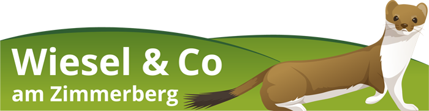

```{r, echo = FALSE}

```


Das Projekt Wiesel & Co am Zimmerberg war von 2014 bis 2021 aktiv.
Viele der News sind auch heute noch interessant.

```{r, echo = FALSE}
# library(dplyr)
# library(kableExtra)
# texts <- c(
#   "Hatten Sie das Glück einen Iltis, Hermelin oder ein Mauswiesel in seiner natürlichen Umgebung zu beobachten? Dann Melden Sie uns ihre Sichtung!",
#   "Was gibt's neues bei Wiesel & Co? Erfahren Sie hier was bei uns gerade so läuft",
#   "Was wollen wir mit unserem Projekt erreichen? Erfahren Sie hier mehr über unsere Ziele",
#   "Warum sind wir von Kleinraubtieren so fasziniert? Hier können Sie mehr über diese spannenden Tierarten lernen!"
#   )
# 
# images <- c("beobachtung.jpg",  "news.jpg",  "ziele.jpg",  "faszination.jpg")
# links <- c("Beobachtung-Melden.html","News.html","Projekt.html","Unsere-Zielarten.html")
# 
# 
# tibble(imgs = "", text = texts) %>%
#   kableExtra::kbl(col.names = NULL) %>%
#   column_spec(1, image = images,width = "10cm",link = links) 
```

